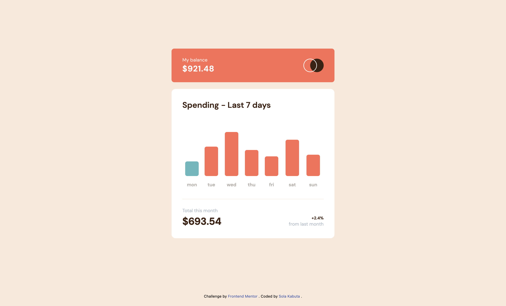

# Frontend Mentor - Expenses chart component solution

This is a solution to the [Expenses chart component challenge on Frontend Mentor](https://www.frontendmentor.io/challenges/expenses-chart-component-e7yJBUdjwt). Frontend Mentor challenges help you improve your coding skills by building realistic projects. 

## Table of contents

- [Overview](#overview)
  - [The challenge](#the-challenge)
  - [Screenshot](#screenshot)
  - [Links](#links)
- [My process](#my-process)
  - [Built with](#built-with)
  - [What I learned](#what-i-learned)
  - [Continued development](#continued-development)
  - [AI Collaboration](#ai-collaboration)
- [Author](#author)

**Note: Delete this note and update the table of contents based on what sections you keep.**

## Overview

### The challenge

Users should be able to:

- View the bar chart and hover over the individual bars to see the correct amounts for each day
- See the current day’s bar highlighted in a different colour to the other bars
- View the optimal layout for the content depending on their device’s screen size
- See hover states for all interactive elements on the page
- **Bonus**: Use the JSON data file provided to dynamically size the bars on the chart

### Screenshot




### Links

- Solution URL: [Add solution URL here](https://your-solution-url.com)
- Live Site URL: [Add live site URL here](https://your-live-site-url.com)

## My process

### Built with

- Semantic HTML5 markup
- [Tailwindcss](https://tailwindcss.com/)Tailwindcss CLI and CSS custom properties
- Mobile-first workflow

### What I learned

Use this section to recap over some of your major learnings while working through this project. Writing these out and providing code samples of areas you want to highlight is a great way to reinforce your own knowledge.

I originally chose this challenge to review the basics, but it turned out to be a great opportunity to learn new things and explore different ways of displaying data.


```js
  // DISPLAY CHART COLOR BASED ON CURRENT DAY WITH HOVER STATE
  let currentDayColor = (item.day === currentDayName) ? 'bg-[#76B5BC] hover:bg-[#B4DFE5]' : 'bg-[#EC755D] hover:bg-[#FF9B87]';
```


### Continued development

It would be nice to upgrade this app using a framework so it can be connected to live data and become a truly usable application.

### AI Collaboration

I used Gemini to brainstorm solutions whenever I was running out of ideas and to test the AGENTS.md setup. It worked perfectly, and I really appreciated its clear, pedagogical approach. I’ll definitely use it again in the future to learn new things. For me, it was clearly the best way to use AI.

## Author

- Website - [portfolio](https://solakabuta.com)
- Frontend Mentor - [@SolaKabuta](https://www.frontendmentor.io/profile/SolaKabuta)
- Twitter - [@sola_kabuta](https://x.com/sola_kabuta)

